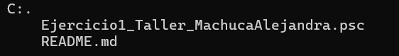

# Pseint

Este es un trabajo asignado en clase.

# Descripción

En este repositorio encontraras un archivo [.psc] que contiene un código fácil de entender para principiantes en la programación.

# Estructura

Este programa trae un menú fácil de entender para los usuarios, donde podrán encontrar una tienda de celulares y podrán  ver, agregar, actualizar, realizar ventas y mostrar las ventas ya realizadas de los productos.

# Características
- Archivo [Ejercicio1_Taller_MachucaAlejandra.psc] que contiene el código utilizado para la realización del taller.
- Archivo [README.md] que contiene la explicación del código.

# Instrucciones
1. Copiar el enlace del repositorio y clonarlo.
2. Abrir el repositorio ya clonado en la herramienta Pseint.

# Desarrollado por

El trabajo fue realizado por Alejandra Machuca, estudiante de CampusLands.